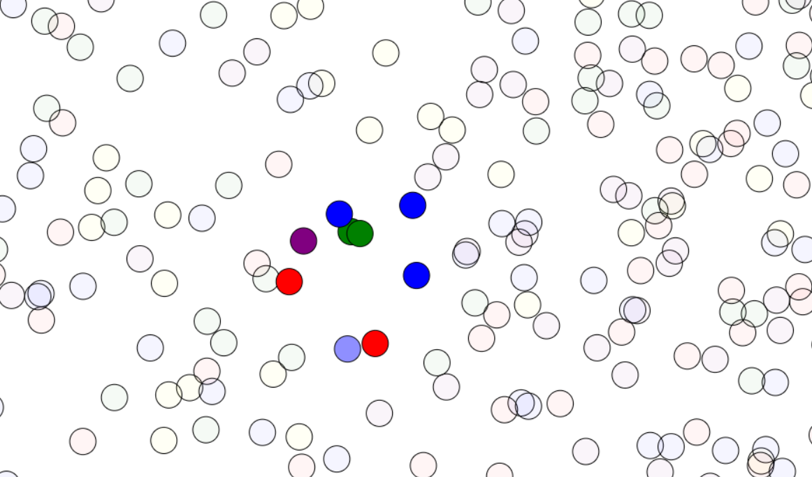

  

        <h1>Canvas Collision Animation</h1>
        
        
This project demonstrates a simple collision animation implemented using HTML canvas and JavaScript. Balls are generated randomly within the canvas area and move around, bouncing off the walls and each other when they collide.

        
   <h2>Features</h2>
        <ul>
            <li><strong>Elastic Collision:</strong> Balls react to collisions using the principles of elastic collision, conserving both momentum and kinetic energy.</li>
            <li><strong>Interactive Effects:</strong> Hovering over a ball changes its opacity, creating an interactive effect.</li>
            <li><strong>Dynamic Rendering:</strong> The animation continuously updates, providing a dynamic visual experience.</li>
        </ul>
        
  <h2>Technologies Used</h2>
        <ul>
            <li><strong>HTML Canvas:</strong> The animation is created using the HTML canvas element, providing a versatile drawing surface.</li>
            <li><strong>JavaScript:</strong> The animation logic and collision calculations are implemented using JavaScript.</li>
            <li><strong>CSS:</strong> Minimal CSS styling is applied to the canvas element for layout and appearance.</li>
        </ul>
        
  <h2>How to Use</h2>
        <ol>
            <li>Clone the repository to your local machine.</li>
            <li>Open <code>index.html</code> in your web browser to view the animation.</li>
            <li>Move your mouse over the balls to interact with them and observe their behavior.</li>
        </ol>
        
  <h2>Credits</h2>
        <ul>
            <li>This project is inspired by various tutorials and examples of canvas animations available online.</li>
            <li>Special thanks to the contributors of JavaScript and HTML canvas resources that helped in understanding the concepts behind collision detection and animation.</li>
        </ul>
        
   <h2>License</h2>
        
This project is licensed under the <a href="#">MIT License</a>, allowing for free use and modification.

    

